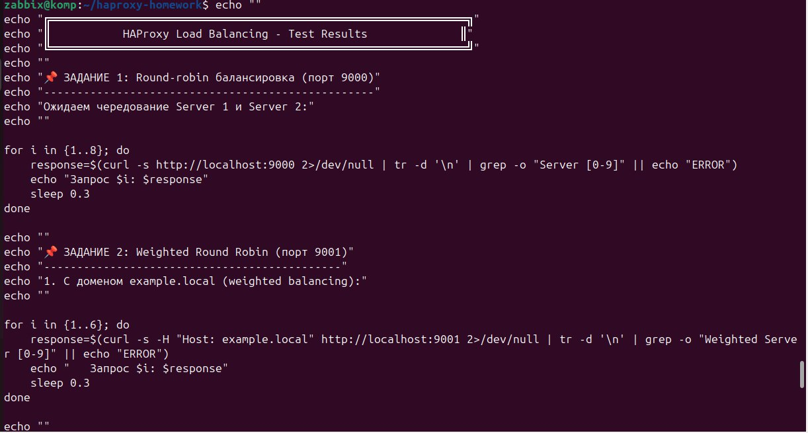

# HAProxy Load Balancing Solution

## Author: Kirill Frolushkin

## Task 1: Round-robin Load Balancing (Layer 4)

### Configuration:
- HAProxy Port: 9000
- Backend Servers: 8881, 8882
- Algorithm: Round-robin

### Config File: configs/haproxy_task1.cfg

### Test Results:
```
Request 1: Server 2
Request 2: Server 1
Request 3: Server 2
Request 4: Server 1
Request 5: Server 2
Request 6: Server 1
```

✅ Perfect round-robin distribution

## Task 2: Weighted Round Robin (Layer 7)

### Configuration:
- HAProxy Port: 9001
- Weighted Servers: 8883(weight 2), 8884(weight 3), 8885(weight 4)
- Default Server: 8080
- Domain-based routing for: example.local

### Config File: configs/haproxy_task2.cfg

### Test Results:

**With domain example.local (weighted balancing):**
```
Request 1: Weighted Server 3
Request 2: Weighted Server 2
Request 3: Weighted Server 3
```

**Without domain (default server):**
```
Request 1: Default Server
Request 2: Default Server
```

✅ Domain-based routing working correctly
✅ Weighted balancing according to weights

## Screenshots

### Task 1: L4 Load Balancing


### Task 2: L7 Load Balancing with domain


### Task 2: L7 Load Balancing without domain


## Quick Start:
```bash
# Install HAProxy
sudo apt install haproxy

# Start Python servers
python3 -m http.server 8881 &
python3 -m http.server 8882 &
python3 -m http.server 8883 &
python3 -m http.server 8884 &
python3 -m http.server 8885 &
python3 -m http.server 8080 &

# Start HAProxy
sudo haproxy -f configs/haproxy_task1.cfg &
sudo haproxy -f configs/haproxy_task2.cfg &

# Test
for i in {1..6}; do curl http://localhost:9000; done
for i in {1..3}; do curl -H "Host: example.local" http://localhost:9001; done
for i in {1..2}; do curl http://localhost:9001; done
```

## Repository:
https://github.com/frolushkinkirill-hash/haproxy-load-balancing.git
